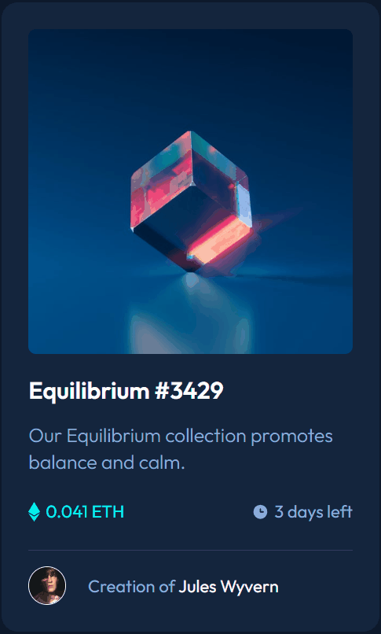

# NFT PREVIEW CARD COMPONENT - FRONTEND MENTOR

[<p align="center">](https://rrsf95.github.io/frontend-mentor-nft-preview-card/)</p>


## DESCRIÇÃO ✔
<strong>Desafio do FrontEnd Mentor - NFT preview card component.</strong>
<br><br> 
Link do desafio:
https://www.frontendmentor.io/challenges/nft-preview-card-component-SbdUL_w0U
<br><br>
Este desafio foi executado com o intuito de aprofundar os conhecimentos em HTML e CSS.

## FUNCIONALIDADES DO PROJETO ⚙
O projeto se baseia em uma página web responsiva para desktop e mobile.

## TECNOLOGIAS UTILIZADAS 💻
- HTML
- CSS

Para este projeto foi utilizado HTML e CSS, por meio do Flexbox foram executadas as estilizações da estrutura criada pelo  HTML;

## COMO UTILIZAR 🛠
Clone o projeto do repositório para uma melhor compreensão do código;

```
git clone https://github.com/RRSF95/frontend-mentor-nft-preview-card.git
```

Caso queira somente visualizar a página, pode visitar o link abaixo:

https://rrsf95.github.io/frontend-mentor-nft-preview-card/

## STATUS DO PROJETO 🏆
O projeto já está finalizado.


